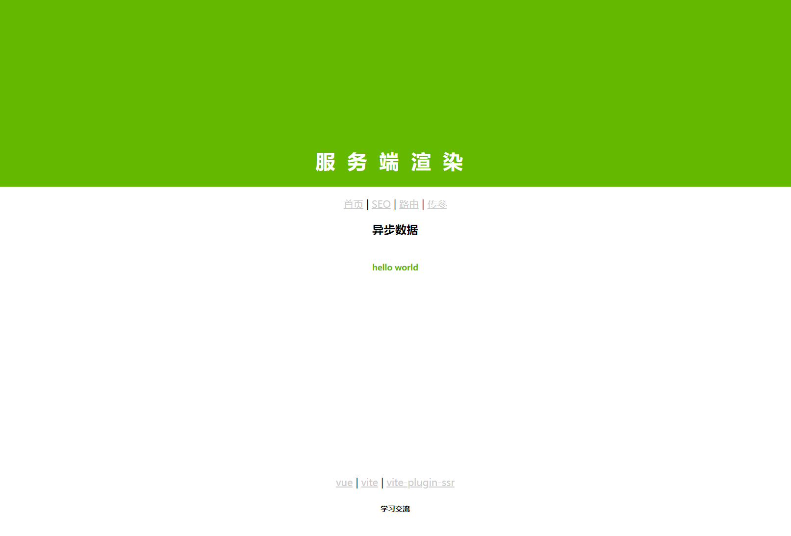

## 预渲染
*.page.server.js

```
export { onBeforeRender }

/**
 * 模拟异步请求
 * @returns result
 */
const asyncDataDemo = async () => {
  return new Promise((resolve, reject) => {
    setTimeout(() => {
      resolve('hello world')
    })
  })
}

/**
 * 
 * @param {*} pageContext 
 * @returns 
 */
async function onBeforeRender(pageContext) {
  return {
    // 页面扩展
    pageContext: {
      // 映射页面props接收
      pageProps: {
        asyncDataDemo: await asyncDataDemo()
      }
    }
  }
}

```
*.vue

```
const props = defineProps({
  asyncDataDemo: {
    type: String
  }
})
```

## 路由配置
*.page.route.js/参数

```
export default '/route'
export default '/param/:param'
```

*.page.server.js
```
export { onBeforeRender }

async function onBeforeRender(pageContext) {
  return {
    pageContext: {
      pageProps: {
        routeParams: pageContext.routeParams
      }
    }
  }
}
```

路由跳转

```
<a href="/">返回首页</a>
```

```
<template>
	<button @click="click">返回首页</button>
</template>
<script setup>
	import { navigate } from "vite-plugin-ssr/client/router";
	const click = () => {
	  navigate('/', { keepScrollPosition: true })
	}
</script>
```


*.vue

```
const props = defineProps({
  routeParams: {
    type: Object
  }
})
```

## SEO

*.page.server.js
```

export { onBeforeRender }

async function onBeforeRender(pageContext) {
  return {
    pageContext: {
      documentProps: {
        title: '标题',
        description: '描述',
        keywords: '关键字'
      }
    }
  }
}
```

## 监听页面

```
const { hydrationPromise } = useClientRouter({
  onTransitionStart,
  onTransitionEnd,
})

hydrationPromise.then(() => {
  console.log('水合完成')
})

/**
 * 页面动画
 */
function onTransitionStart() {
  console.log('页面跳转前')
}
function onTransitionEnd() {
  console.log('页面跳转后')
}

```

## 详细文档
https://vite-plugin-ssr.com/


```
dev：开发环境
prod：生产环境
```


****如果有什么缺陷，帮忙提出或者修改****

****修改创建一个新的分支****